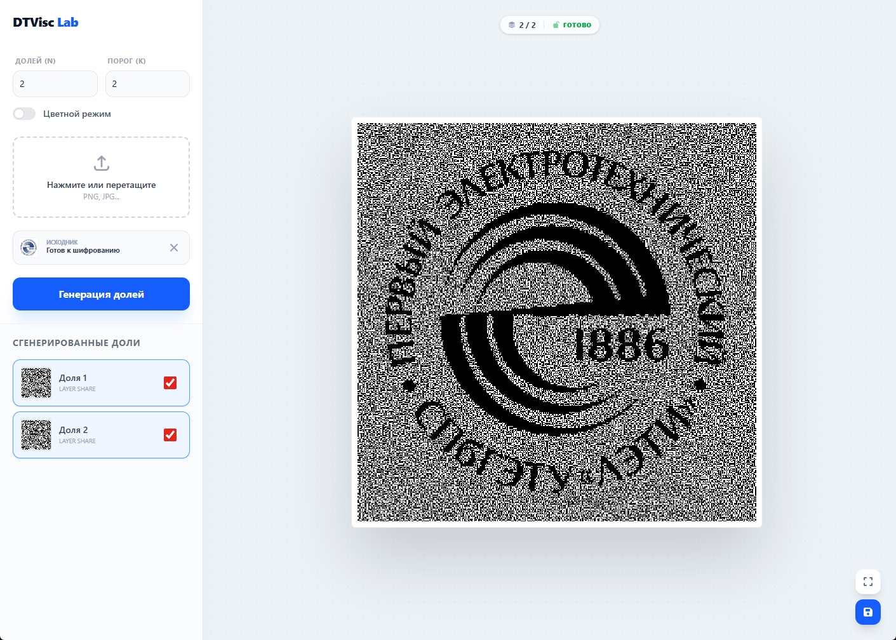
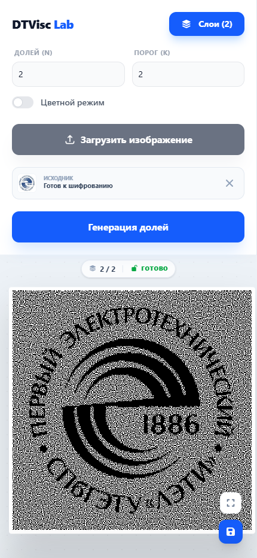

# DTVisc Lab - Visual Cryptography Tool

## Визуальная криптография (k, n)

<div>

  
  
  
  
  

  <br />

  <p align="center">
    <a href="#english">English</a> • <a href="#russian">Русский</a>
  </p>
</div>

> **[Live Demo](https://dmitrii1011sg.github.io/visc-frontend-app/)**

### Screenshots / Скриншоты

<div align="center">
  <table border="0">
    <tr>
      <td align="center" valign="bottom">
        <br />
        <b>Desktop Version</b>
      </td>
      <td align="center" valign="bottom">
        <br />
        <b>Mobile Version</b>
      </td>
    </tr>
  </table>
</div>
---

<a name="english"></a>

## 🇬🇧 English Version

### Project Overview

**DTVisc Lab** is an interactive web application designed to demonstrate and implement **(k, n) Visual Secret Sharing (VSS)** schemes based on the Naor-Shamir algorithm. This tool allows users to encrypt images into multiple shares, requiring a specific threshold of shares to be overlaid to reveal the original secret.

The project is built using a high-performance stack, leveraging **WebAssembly (WASM)** for cryptographic computations and **Angular 18** for a reactive user interface.

### Key Features

- **Threshold Schemes:** Supports various (k, n) configurations using both combinatorial and functional approaches.
- **Color & Monochrome:** Support for standard binary encryption and color indexing (Yang-Lai method).
- **High Performance:** Cryptographic core implemented in C++ and compiled to WASM.
- **Responsive UI:** Mobile-first design with touch support (Pinch-to-zoom) for interactive share overlay.
- **Offline-Ready:** All computations happen locally in your browser.
- **Export:** Batch export of shares as PNG files in a ZIP archive.

### Technology Stack

- **Frontend:** Angular 18 (Signals, Web Workers)
- **Core:** C++ 20 / WebAssembly (WASM)
- **Styling:** Tailwind CSS

### Installation & Development

1.  **Clone the repository:**
    ```bash
    git clone https://github.com/dmitrii1011sg/visc-frontend-app.git
    cd visc-frontend-app
    git submodule update --init --recursive
    ```
2.  **Install dependencies:**
    ```bash
    pnpm install
    ```
3.  **Build lib:**
    ```bash
    ./build-wasm.sh
    ```
4.  **Run development server:**
    ```bash
    ng serve
    ```
    Access the app at `http://localhost:4200/`.

---

<a name="russian"></a>

## 🇷🇺 Русская версия

### О проекте

**DTVisc Lab** — это интерактивное веб-приложение для демонстрации и реализации схем **визуального разделения секрета (k, n)** на основе алгоритма Наора-Шамира. Инструмент позволяет зашифровать изображение, разбив его на несколько долей (shares), при наложении которых (в количестве не менее порога k) восстанавливается исходное сообщение.

Проект разработан с использованием высокопроизводительного стека: расчетное ядро на **WebAssembly (WASM)** и реактивный интерфейс на **Angular 18**.

### Основные возможности

- **Пороговые схемы:** Поддержка различных конфигураций (k, n) с использованием комбинаторного и функционального методов.
- **Цвет и монохром:** Поддержка бинарного шифрования и цветной индексации (метод Ян-Лая).
- **Производительность:** Криптографическое ядро реализовано на C++ и скомпилировано в WASM для работы на околонативной скорости.
- **Адаптивный UI:** Дизайн, ориентированный на мобильные устройства, с поддержкой жестов (Pinch-to-zoom) для интерактивного наложения долей.
- **Конфиденциальность:** Все вычисления происходят локально в браузере; данные не передаются на сервер.
- **Экспорт:** Пакетное скачивание долей в формате PNG в составе ZIP-архива.

### Технологический стек

- **Frontend:** Angular 18 (Signals, Web Workers)
- **Core:** C++ 20 / WebAssembly (WASM)
- **Стилизация:** Tailwind CSS

### Установка и разработка

1.  **Клонировать репозиторий:**
    ```bash
    git clone https://github.com/dmitrii1011sg/visc-frontend-app.git
    cd visc-frontend-app
    git submodule update --init --recursive
    ```
2.  **Установить зависимости:**
    ```bash
    pnpm install
    ```
3.  **Собрать библиотеку:**
    ```bash
    ./build-wasm.sh
    ```
4.  **Запустить сервер разработки:**
    ```bash
    ng serve
    ```
    Приложение будет доступно по адресу `http://localhost:4200/`.
